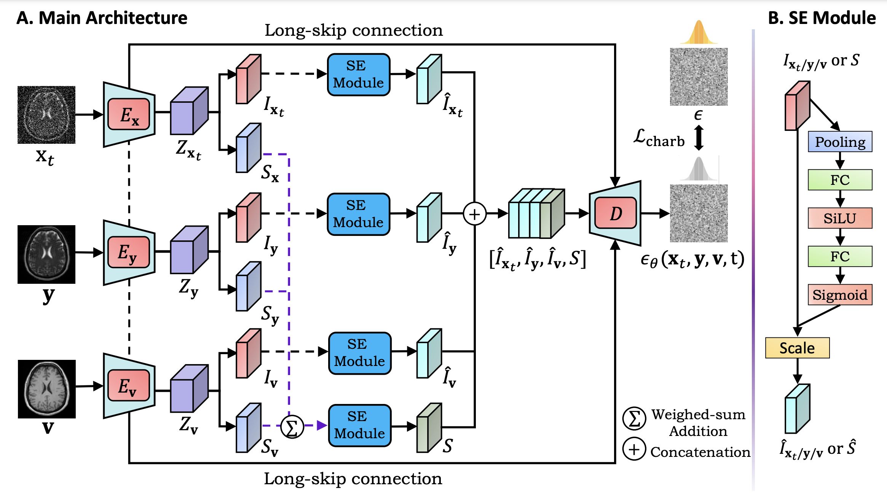
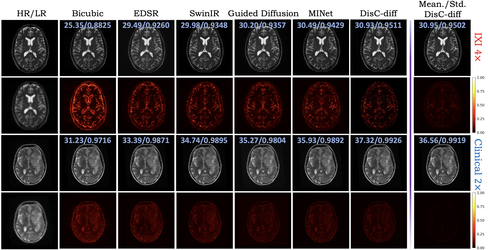

# DisC-Diff
This repository is implemented based on [openai/guided-diffusion](https://github.com/openai/guided-diffusion), with modifications for loss functions and backbone network improvements.

[**DisC-Diff: Disentangled Conditional Diffusion Model for Multi-Contrast MRI Super-Resolution**](https://arxiv.org/abs/2303.13933)<br/>
[Ye Mao](https://yebulabula.github.io/)\*,
Lan Jiang \*,
Xi Chen \,
Chao Li,
<br/>

DisC-Diff is multi-contrast brain MRI super-resolution method designed based on denoising diffusion probabilistic models. Specifically, DisC-Diff leverages a disentangled multi-stream network to exploit complementary information from multi-contrast MRI, improving model interpretation under multiple conditions of multi-contrast inputs. We validated the effectiveness of DisC-Diff on two datasets: the IXI dataset, which contains 578 normal brains, and a clinical dataset with 316 pathological brains.

## Dependencies
A [conda](https://conda.io/) environment named `DisC-Diff` can be created
and activated by running the following commands:

```
conda env create -f environment.yaml
conda activate DisC-Diff
```

## Dataset & Pretrained Models
- The processed IXI dataset for training and testing can be downloaded through this [link](https://drive.google.com/drive/folders/1i2nj-xnv0zBRC-jOtu079Owav12WIpDE). 
- The models pretrained on IXI dataset under x2 & x4 resolution scale can be downloaded through this [link](https://drive.google.com/drive/folders/1qZeZwkuEvWFJM8BCMK9rGE0s2tAEKAAy).

## Model Training
1. Modify the arguments `hr_data_dir`, `lr_data_dir`,and `other_data_dir` in **config/config_train.yaml** into the paths for your downloaded training `T2-HR`, `T2-LR`, and `T1-HR` data.
2. In train_job.sh, replace the second line into `export PYTHONPATH= "Your Repository Path"`.
3. Run `bash train_job.sh`.

## Model Evaluation
1. Modify the arguments `hr_data_dir`, `lr_data_dir`,and `other_data_dir` in **config/config_test.yaml** into the paths for your downloaded testing `T2-HR`, `T2-LR`, and `T1-HR` data.
2. In test_job.sh, replace the second line into `export PYTHONPATH= "Your Repository Path"`.
3. Run `bash test_job.sh`.
4
**Sample Results**



## BibTeX

```
@article{mao2023disc,
  title={DisC-Diff: Disentangled Conditional Diffusion Model for Multi-Contrast MRI Super-Resolution},
  author={Mao, Ye and Jiang, Lan and Chen, Xi and Li, Chao},
  journal={arXiv preprint arXiv:2303.13933},
  year={2023}
}
```
